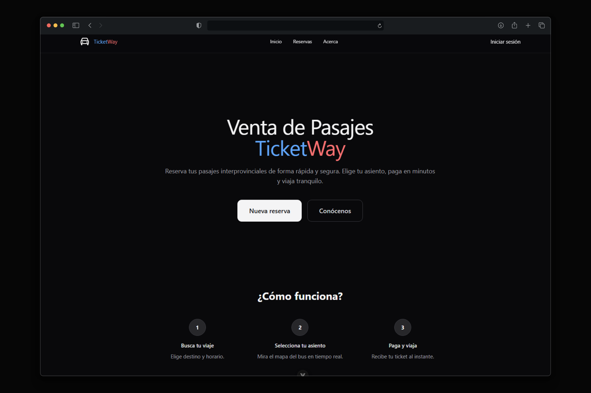

# TicketWay

TicketWay es una aplicación web de reserva de pasajes para viajes interprovinciales de forma rápida y segura. Permite reservar pasajes en tiempo real, seleccionar asientos y pagar en minutos.

### Requisitos

- Python 3.10
- Django 4.1
- PostgreSQL
- Redis
- Vue 3.2

### Instalación

1. Clona el repositorio
2. Instala las dependencias
3. Crea una base de datos
4. Crea un usuario y una contraseña
5. Ejecuta el servidor de desarrollo
6. Accede a http://localhost:8000

